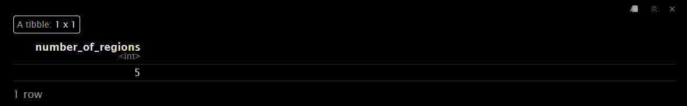

# CodeClan Wine: Linear Regression Modelling

## Introduction

This example was used as a homework exercise in CodeClan and shows two ways to build a multiple linear regression model on a synthetic, wine-based dataset.  

The data in question started life in the UCI machine learning repository, https://archive.ics.uci.edu/ml/datasets/wine+quality.

Ref: *P. Cortez, A. Cerdeira, F. Almeida, T. Matos and J. Reis. Modeling wine preferences by data mining from physicochemical properties. In Decision Support Systems, Elsevier, 47(4):547-553, 2009.*

The first modelling run will focus on a manual model build, followed by an
automated build to see if there are any differences in the final model.

The wine data is contained in two datasets, namely `wine_quality_red` and 
`wine_quality_white`.  The overall aim is to model the `quality` of the wines 
using linear regression to try to determine what makes a "good" wine.

There are many ways to build an explanatory model like this so this isn't
intended to be the **absolute** best answer, but shows in detail the regression
model building process in R.

## Data & Data Cleaning 

Load libraries:

```{r, warning = FALSE, message = FALSE}
library(tidyverse)
library(GGally)
library(modelr)
library(janitor)
library(here)
library(ggfortify)
library(performance)
library(see)
library(leaps)

```

Read the data for red wine;

```{r}
wine_red <- read_csv(here("data/wine_quality_red.csv"))
head(wine_red)
```


So there's an ID column and 13 variables including `quality`. 

 

Read in the white wine data;

```{r}
wine_white <- read_csv(here("data/wine_quality_white.csv"))
head(wine_white)
```


This is in the same format as the red wine data, with the same variables. This 
suggests that joining the two datasets with a colour identifying column could be
one way to handle both sets of data simultaneously.

First of all, create the colour identifying columns;

```{r}
wine_red <- wine_red %>% 
  mutate(wine_colour = "red", .before = fixed_acidity)

wine_white <- wine_white %>% 
  mutate(wine_colour = "white", .before = fixed_acidity)
  
```


If the two datasets are to be combined then the `wine_id` number needs to be
handled to avoid duplicates.  The `wine_id` isn't something that necessarily 
reflects the physiochemical properties of a "good" wine, so could probably be 
removed completely upon joining the datasets.  

```{r}
# first join white wine to red wine;
wine_all <- bind_rows(wine_red, wine_white)

# then remove wine_id
wine_all <- wine_all %>% 
  select(-wine_id)
```


Apart from wine colour, there's only one categorical data column which might 
need to be converted to a factor for the purposes of regression - `region`.  
Check how many discrete values are involved;

 

```{r}
wine_all %>%
  distinct(region) %>%
  summarise(number_of_regions = n())
```

So there are five regions; Australia, Spain, Italy, USA, France. These and the
wine colour should be changed to factor data;

```{r}
wine_all <- wine_all %>% 
  mutate(region = as.factor(region),
         wine_colour = as.factor(wine_colour))

# and check;
# class(wine_all$region)
# class(wine_all$wine_colour)
```


Now check for aliased variables (i.e. combinations of variables in which one or
more of the variables can be calculated from other variables):


```{r}
alias(quality ~ ., data = wine_all)
```

There are no obvious aliases returned, but some sound very similar (e.g.
`fixed_acidity` and `volatile_acidity`,  `free_sulfur_dioxide` and
`total_sulfur_dioxide`) so it's worth watching these as the regression progresses.


## First predictor variable

`GGally::ggpairs()` is a useful tool for deciding which variable to pick as a 
predictor, but can take some time to run.  This can be mitigated by splitting
up the data beforehand;

 

```{r, message = FALSE}
# start with quality and acidity variables 
wine_all %>%
  select(quality, fixed_acidity, volatile_acidity, citric_acid, p_h) %>%
  ggpairs(aes(alpha = 0.3))
```
Despite initial misgivings it looks like the acidity variables are not especially
correlated with each other so there's no justification to remove them. 

The highest correlation with `quality` is `volatile_acidity`, but it is weak at
-0.25. 

Look at the remaining variables;

```{r, message = FALSE}
wine_all %>%
  select(quality, residual_sugar, chlorides, free_sulfur_dioxide, total_sulfur_dioxide, sulphates, density, alcohol) %>%
  ggpairs(aes(alpha = 0.3)) +
  theme(text= element_text(size = 6)) # make headers more legible
```
It's evident from this that `alcohol` and `density` have a strong positive
correlation of 0.7, so we don't need both here.  Drop `density` from the model.

It's also clear that `total_sulfur_dioxide` is strongly correlated with
`free_sulfur_dioxide` so for modelling only consider `total_sulfur_dioxide`.


```{r}
wine_all <- wine_all %>%
  select(-density, -free_sulfur_dioxide)
```

With the aim of modelling against `quality`, `alcohol` returns a moderate
correlation of 0.4 and `chlorides` a weak correlation of 0.2.

Next, consider the categorical variables, `wine_colour` and `region`: 

```{r, message = FALSE}
wine_all %>%
  select(quality, wine_colour, region) %>%
  ggpairs() 
```
These plots suggest no practical correlation between `quality` and either
`region` or `colour`.

For a first model our largest correlation coefficients came from `alcohol`,
`chlorides`, and `volatile_acidity`.  

Taking these individually and comparing;


```{r, warning = FALSE, message = FALSE}
# define the model with the first predictor variable
mod1a <- lm(quality ~ alcohol, data = wine_all)

# check the diagnostics
check_model(mod1a)

# check the summary 
summary(mod1a)

```

The diagnostic plots don't give any reason for concern at this stage.  Now check
what `chlorides` looks like.

```{r}
# define the model 
mod1b <- lm(quality ~ chlorides, data = wine_all)

# check the diagnostics
check_model(mod1b)

# check the summary output
summary(mod1b)
```
In this case homogeneity and linearity are not ideal.  Is this due to outliers?

```{r}
check_outliers(mod1b)
```

or non-normal residuals distribution?
```{r}
check_normality(mod1b)
```
This may explain some of the "imperfect" diagnostic plots.

Taking the third option of `total_sulfur_dioxide`;

```{r}
# define the model 
mod1c <- lm(quality ~ total_sulfur_dioxide, data = wine_all)

# check the diagnostics
check_model(mod1c)

# check the summary output
summary(mod1c)
```

Once again homogeneity and linearity don't look ideal.  

```{r}
check_outliers(mod1b)
check_normality(mod1b)
```

Once again this is due to non-normally distributed residuals.

This suggests that `alcohol` is the best choice as a first predictor variable for
the model.  

`ggpairs()` can now be re-run with the residuals to try to identify a good second
predictor.

## Second predictor variable

```{r, warning = FALSE, message = FALSE}
wine_residuals <- wine_all %>%
  add_residuals(mod1a) %>%
  select(-c("quality", "alcohol")) # remove the variables already in the model

ggpairs(wine_residuals, aes(alpha = 0.3)) 
```

There aren't any immediately obvious strong correlations between any numeric 
variables here.

`chlorides` once again looks feasible, as do `volatile_acidity` and 
`residual_sugar` for a second predictor.

```{r}
# define the model
mod2a <- lm(quality ~ alcohol + chlorides, data = wine_all)
# check the diagnostics
check_model(mod2a)
# Summarise
summary(mod2a)
```
This returns an adjusted R^2 of around 0.19, suggesting that these predictors
could account for approximately 19% of the variation in our data.  Chlorides is
also shown to be statistically significant in this model.

What does `volatile acidity` look like:


```{r}
# define the model
mod2b <- lm(quality ~ alcohol + volatile_acidity, data = wine_all)

# check the diagnostics
check_model(mod2b)

# summarise
summary(mod2b)
```
This looks better than `chlorides`, explaining around 23% of the variation
in our data.

Check `residual_sugar`;

```{r}
# define the model
mod2c <- lm(quality ~ alcohol + residual_sugar, data = wine_all)

# check diagnostics
check_model(mod2c)

# summarise
summary(mod2c)
```

It looks like `mod2b` using `alcohol` and `volatile_acidity` comes out as the
best option for a second predictor. It's worth noting however that although 
`chlorides` and `residual_sugar` did not perform as well, they do still have 
significant p-values (both at < 0.001).

Is it justifiable to make a more complex model  (i.e. single predictor vs two 
predictors)?  Check using ANOVA (ANalysis Of VAriables).

mod1a = quality ~ alcohol
mod2b = quality ~ alcohol + volatile_acidity

We want to compare the two;
```{r}
anova(mod1a, mod2b)
```

The addition of `volatile_acidity` in mod2b creates a better model with a lower 
Residual Sum of Squares, low p-value and high significance.

Even adding this significant predictor didn't give much of an increase in 
adjusted R^2, so adding more and more predictors is only likely to return ever
decreasing marginal increases in the model's ability to explain variation.

It could be that there's an interaction between our current predictor variables, 
so it would be worth investigating that;

## Pair interaction

Let's now think about possible pair interactions: for two main effect variables
(`alcohol + volatile_acidity`) we have one possible pair interaction. 


```{r}
mod_interaction <- lm(quality ~ alcohol + volatile_acidity + alcohol:volatile_acidity, data = wine_all)
summary(mod_interaction)
```

Adding this interaction only adds a tiny amount to the adjusted R^2. It might
be worth checking using ANOVA if including this interaction in the model is justified:

```{r}
#  Justified in adding this interaction!
anova(mod2b, mod_interaction)
```


The interaction is significant, so the final model is:

<center>

`quality ~ alcohol + volatile_acidity + alcohol:volatile_acidity`

</center>

The model only explains around 24% of the variation in our data, but it might 
still be useful depending on the context of the data and situation it's being
applied to.

It would have been possible to have continued to add predictors for diminishing
returns, or alternatively the model building process could have been performed 
in a more automated way, as shown briefly below;

## Automated approach using `leaps`

The `leaps` package could be used to make a predictive model using a more 
automated workflow.

First of all set up the `regsubsets` function to try adding all predictors to a 
model and show which are the most "powerful" contributors;

```{r}
regsubsets_forward <- regsubsets(quality ~ ., # use all of the possible variables
                                 data = wine_all, 
                                 nvmax = 12, # model can have max of 12 predictors
                                 method = "forward" # forward selection
                                 )

plot(regsubsets_forward)
```

This resulting plot indicates that the best performing model (i.e. top row) uses
`wine_colourwhite`,`volatile_acidity`, `residual_sugar`, `chlorides`, `sulphates`,  and `alcohol`. 

```{r}
summary(regsubsets_forward)$which[6,]

```


The bIC scores can also be plotted to check predictor performance;

```{r}
sum_regsubsets_forward <- summary(regsubsets_forward)

sum_regsubsets_forward$bic
```
And then plot the BIC scores;

```{r}
plot(summary(regsubsets_forward)$bic, type = "b")

```


This plot suggests that the BIC score is lowest using 6 different predictor
variables in the model. We can check which variables these are:


```{r}
sum_regsubsets_forward$which[6, ]
```


This means that the automated model build has suggested a model with
`wine_colourwhite`,`volatile_acidity`, `residual_sugar`, `chlorides`, `sulphates`,
and `alcohol`.  

This is more predictors than the previous manual model build, but there is often 
no single 'correct' answer in regression modelling.

What about if we limited it to two predictors?

```{r}
sum_regsubsets_forward$which[2, ]
```

The best two predictors are suggested as `volatile_acidity` and `alcohol`. 

**i.e. the same conclusion as using the manual method (before adding the interaction)**

The `leaps` package doesn't include interactions, but they could be included in 
the same way as shown during the manual modelling above. 
